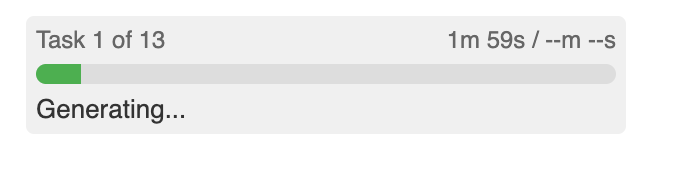
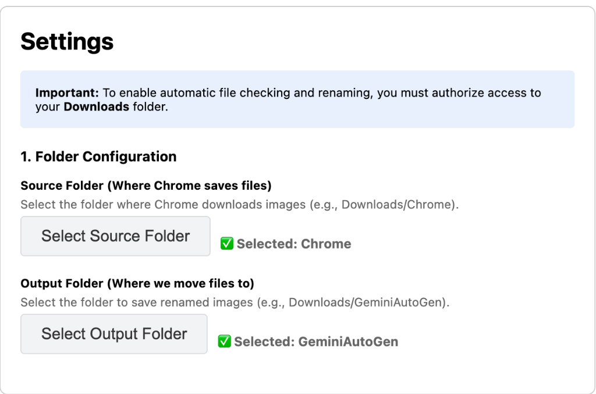

# Gemini Auto Image Generator

A Chrome Extension that automates batch image generation on Google Gemini. Load a JSON file with image prompts, and the extension will automatically generate high-resolution images (~5MB each) and save them with custom filenames.



## ✨ Features

- **Batch Processing** - Load hundreds of prompts from a JSON file and process them automatically
- **High-Resolution Downloads** - Clicks "Download full size" to get the maximum quality images
- **Smart Skip** - Automatically skips already-generated images
- **Conversation Lock** - Lock to a specific Gemini chat URL for consistent context
- **Progress Tracking** - Real-time progress bar with elapsed/remaining time estimates
- **Auto-Rename** - Automatically renames downloaded files to your specified names
- **Retry on Failure** - Auto-retry per image with configurable limits
- **Live Log Window** - Inline log viewer with copy/clear controls
- **Dark Mode UI** - Side panel follows system light/dark theme

## 📦 Installation

1. Clone this repository:

   ```bash
   git clone https://github.com/fangwangme/GeminiAutoGen.git
   ```

2. Open Chrome and navigate to `chrome://extensions/`

3. Enable **Developer mode** (toggle in top-right corner)

4. Click **Load unpacked** and select the cloned folder

5. Click the extension icon and select **Open Side Panel**

## ⚙️ Setup

Before using the extension, you need to configure the file directories:

1. Click the **⚙️ Settings** button in the side panel

2. **Source Folder** - The folder where Chrome automatically downloads files (e.g., `Downloads` or `Downloads/Chrome`)

   - This is where Gemini saves images when you click "Download full size"

3. **Output Folder** - The final destination folder for renamed images (e.g., `Downloads/GeminiOutput`)
   - Images will be automatically renamed and moved here



## 🚀 Usage

### 1. Prepare Your Prompts

Create a JSON file with an array of tasks:

```json
[
  {
    "name": "sunset_beach.png",
    "prompt": "A beautiful sunset over a tropical beach with palm trees"
  },
  {
    "name": "mountain_lake.png",
    "prompt": "A serene mountain lake reflecting snow-capped peaks"
  }
]
```

### 2. Lock Conversation (Optional but Recommended)

To use the same Gemini conversation for all images:

1. Open [Gemini](https://gemini.google.com) and create or open a chat
2. Copy the URL from the address bar
3. Paste it in the **Locked Conversation URL** input
4. Click **Lock**

This ensures all images are generated in the same context, even if you restart the browser.

### 3. Start Generation

1. Load your JSON file using the file picker
2. Click **Start**
3. Watch the progress as images are generated and saved

The extension will:

- Send each prompt to Gemini
- Wait for image generation (up to 5 minutes per image)
- Click "Download full size"
- Rename and move the file to your output folder
- Recreate the browser tab between tasks for reliability

## 🏗️ Architecture

```
├── manifest.json      # Extension config (Manifest V3)
├── sidepanel.html     # Side panel markup
├── options.html       # Options page markup
├── src/sidepanel.ts   # UI and task orchestration
├── src/content.ts     # Single-task processor (IIFE)
├── src/background.ts  # File system operations
├── src/options.ts     # Directory configuration
└── src/utils/idb.ts   # IndexedDB wrapper for handles
```

### Key Design Decisions

| Feature         | Approach           | Why                                   |
| --------------- | ------------------ | ------------------------------------- |
| Content Script  | Dynamic injection  | Avoids polluting the page permanently |
| Task Processing | One task per tab   | Prevents Blob URL corruption          |
| File Detection  | Filesystem polling | More reliable than download listeners |
| Tab Management  | Destroy & recreate | Ensures clean browser context         |

## ⏱️ Timing Defaults

All timing values are configurable in **Settings**.

| Operation             | Default | Description                                       |
| --------------------- | ------- | ------------------------------------------------- |
| Image Generation      | 5 min   | Maximum wait for Gemini to generate               |
| Download Verification | 2 min   | Wait for file to appear in source folder          |
| Input Field Timeout   | 5 sec   | Wait for prompt input to appear                   |
| Task Interval         | 5 sec   | Pause between closing old and opening new tab     |
| Page Stability        | 30 sec  | Wait for page/images to stabilize                 |
| Page Initialization   | 2 sec   | Extra wait after page load (2 × step delay)       |
| Poll Interval         | 1 sec   | Base interval for input/send/generation polling   |
| Step Delay            | 1 sec   | Base delay between UI actions                     |

## 🐛 Troubleshooting

### "Please open gemini.google.com"

- Make sure you're on a Gemini chat page, or lock a conversation URL first

### Downloads fail silently

- This is usually caused by browser context corruption
- The extension automatically recreates tabs between tasks to prevent this

### "No file loaded"

- Your JSON file may be invalid
- Ensure it's an array of objects with `name` and `prompt` properties

### Extension stops unexpectedly

- Click **Reset** to clear all state
- Reload the extension from `chrome://extensions/`
- Start again with your JSON file

## 📄 License

MIT License - feel free to use and modify.

## 🤝 Contributing

Issues and Pull Requests are welcome!

---

**Disclaimer**: This extension automates interactions with Google Gemini. Use responsibly and in accordance with Google's Terms of Service.
