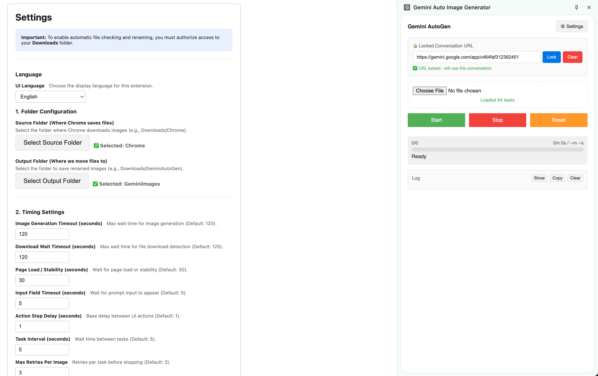

# Nano Banana Image Generator

[English](README.md) | [简体中文](README.zh-CN.md)

A Chrome Extension that automates batch image generation on Google Gemini. Load a JSON file with image prompts, and the extension will automatically generate high-resolution images (~5MB each) and save them with custom filenames.



## ✨ Features

- **Batch Processing** - Load hundreds of prompts from a JSON file and process them automatically
- **High-Resolution Downloads** - Clicks "Download full size" to get the maximum quality images
- **Smart Skip** - Automatically skips already-generated images
- **Conversation Lock** - Lock to a specific Gemini chat URL for consistent context
- **Progress Tracking** - Real-time progress bar with elapsed/remaining time estimates
- **Auto-Rename** - Automatically renames downloaded files to your specified names
- **Retry on Failure** - Auto-retry per image with configurable limits
- **Collapsible Log Window** - Inline log viewer with copy/clear controls
- **Bilingual UI** - English/中文 language switch in Settings
- **Dark Mode UI** - Side panel follows system light/dark theme

## 📦 Installation

### Option 1: Download Release (Recommended)

1. Download the latest release ZIP from [Releases](https://github.com/fangwangme/GeminiAutoGen/releases)
2. Extract the ZIP file to a folder
3. Open Chrome and navigate to `chrome://extensions/`
4. Enable **Developer mode** (toggle in top-right corner)
5. Click **Load unpacked** and select the extracted folder
6. Click the extension icon and select **Open Side Panel**

### Option 2: Build from Source

1. Clone this repository:

```bash
git clone https://github.com/fangwangme/GeminiAutoGen.git
cd GeminiAutoGen
```

2. Install dependencies and build:

```bash
npm install
npm run build
```

3. Open Chrome and navigate to `chrome://extensions/`
4. Enable **Developer mode** (toggle in top-right corner)
5. Click **Load unpacked** and select the `.shared/extension-dist` folder
6. Click the extension icon and select **Open Side Panel**

## ⚙️ Setup

Before using the extension, you need to configure the file directories:

1. Click the **⚙️ Settings** button in the side panel

2. **Source Folder** - The folder where Chrome automatically downloads files (e.g., `Downloads` or `Downloads/Chrome`)

   - This is where Gemini saves images when you click "Download full size"

3. **Output Folder** - The final destination folder for renamed images (e.g., `Downloads/GeminiOutput`)
   - Images will be automatically renamed and moved here

4. **Language** - Choose the UI language (English/中文)

## 🚀 Usage

### 1. Prepare Your Prompts

Create a JSON file with an array of tasks:

```json
[
  {
    "name": "sunset_beach.png",
    "prompt": "A beautiful sunset over a tropical beach with palm trees"
  },
  {
    "name": "mountain_lake.png",
    "prompt": "A serene mountain lake reflecting snow-capped peaks"
  }
]
```

### 2. Lock Conversation (Optional but Recommended)

To use the same Gemini conversation for all images:

1. Open [Gemini](https://gemini.google.com) and create or open a chat
2. Copy the URL from the address bar
3. Paste it in the **Locked Conversation URL** input
4. Click **Lock**

This ensures all images are generated in the same context, even if you restart the browser.

### 3. Start Generation

1. Load your JSON file using the file picker
2. Click **Start**
3. Watch the progress as images are generated and saved

The extension will:

- Send each prompt to Gemini
- Wait for image generation (timeout is configurable in Settings; default 120s)
- Click "Download full size"
- Rename and move the file to your output folder
- Recreate the browser tab between tasks for reliability

## 📚 Technical Docs

To keep this README focused on usage, implementation details are documented in `docs/`:

- `docs/README.md` - technical docs index (best entry point)
- `docs/ARCHITECTURE.md` - architecture overview

## 🐛 Troubleshooting

### "Please open gemini.google.com"

- Make sure you're on a Gemini chat page, or lock a conversation URL first

### Downloads fail silently

- This is usually caused by browser context corruption
- The extension automatically recreates tabs between tasks to prevent this

### "No file loaded"

- Your JSON file may be invalid
- Ensure it's an array of objects with `name` and `prompt` properties

### Extension stops unexpectedly

- Click **Reset** to clear all state
- Reload the extension from `chrome://extensions/`
- Start again with your JSON file

## 📄 License

MIT License - feel free to use and modify.

## 🤝 Contributing

Issues and Pull Requests are welcome!

---

**Disclaimer**: This extension automates interactions with Google Gemini. Use responsibly and in accordance with Google's Terms of Service.
