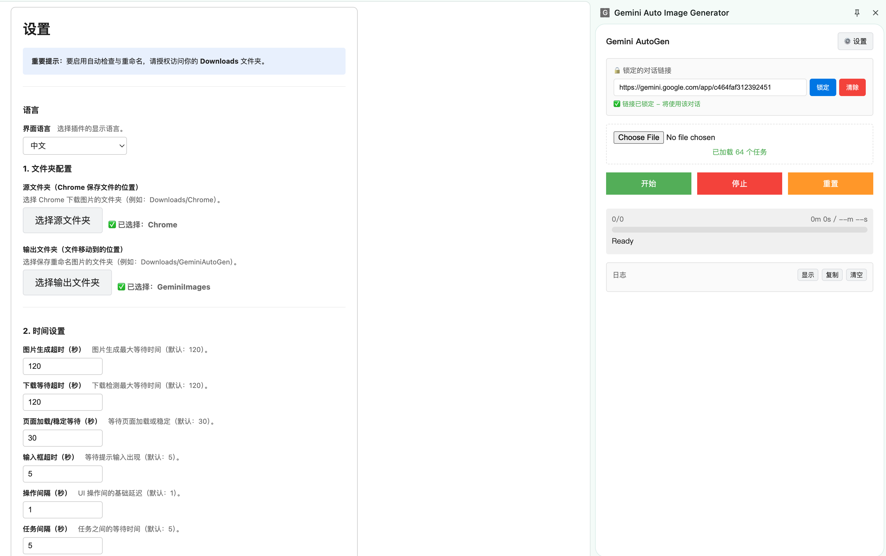

# Gemini Auto Image Generator

[English](README.md) | [简体中文](README.zh-CN.md)

这是一个 Chrome 插件，用于在 Google Gemini 上自动批量生成图片。加载包含提示词的 JSON 文件后，插件会自动生成高分辨率图片（每张约 5MB），并按自定义文件名保存。



## ✨ 功能特性

- **批量处理** - 从 JSON 文件加载大量提示词并自动执行
- **高分辨率下载** - 自动点击“Download full size”获取最高质量图片
- **智能跳过** - 自动跳过已生成的图片
- **对话锁定** - 锁定指定 Gemini 对话链接，保持上下文一致
- **进度追踪** - 实时进度条与耗时/剩余时间估算
- **自动重命名** - 按指定名称重命名并移动下载文件
- **失败重试** - 每张图片自动重试，支持配置上限
- **可折叠日志窗口** - 内置日志视图，支持复制/清空
- **深色模式 UI** - 侧边栏自动跟随系统主题
- **双语界面** - 设置里可切换 English/中文

## 📦 安装

### 方式一：下载 Release（推荐）

1. 从 [Releases](https://github.com/fangwangme/GeminiAutoGen/releases) 下载最新的 ZIP 文件
2. 解压 ZIP 文件到任意文件夹
3. 打开 Chrome 并进入 `chrome://extensions/`
4. 开启 **开发者模式**（右上角开关）
5. 点击 **加载已解压的扩展程序** 并选择解压后的文件夹
6. 点击插件图标并选择 **打开侧边栏**

### 方式二：从源码构建

1. 克隆仓库：

```bash
git clone https://github.com/fangwangme/GeminiAutoGen.git
cd GeminiAutoGen
```

2. 安装依赖并构建：

```bash
npm install
npm run build
```

3. 打开 Chrome 并进入 `chrome://extensions/`
4. 开启 **开发者模式**（右上角开关）
5. 点击 **加载已解压的扩展程序** 并选择 `.shared/extension-dist` 文件夹
6. 点击插件图标并选择 **打开侧边栏**

## ⚙️ 配置

使用前需要配置文件夹权限：

1. 点击侧边栏中的 **⚙️ 设置**

2. **源文件夹** - Chrome 默认下载文件的目录（例如 `Downloads` 或 `Downloads/Chrome`）

   - Gemini 点击“Download full size”后会将图片保存到这里

3. **输出文件夹** - 重命名后的最终保存目录（例如 `Downloads/GeminiOutput`）
   - 图片会自动重命名并移动到此处

4. **语言** - 选择界面语言（English/中文）

## 🚀 使用方法

### 1. 准备提示词

创建一个 JSON 文件，内容为任务数组：

```json
[
  {
    "name": "sunset_beach.png",
    "prompt": "A beautiful sunset over a tropical beach with palm trees"
  },
  {
    "name": "mountain_lake.png",
    "prompt": "A serene mountain lake reflecting snow-capped peaks"
  }
]
```

### 2. 锁定对话（可选但推荐）

为了让所有图片使用同一对话上下文：

1. 打开 [Gemini](https://gemini.google.com) 并创建或打开一个对话
2. 复制地址栏中的链接
3. 粘贴到 **锁定的对话链接** 输入框
4. 点击 **锁定**

这样即使重启浏览器，也能保持同一对话上下文。

### 3. 开始生成

1. 使用文件选择器加载 JSON
2. 点击 **开始**
3. 观察进度，等待图片生成并保存

插件会自动完成：

- 将每条提示发送到 Gemini
- 等待图片生成（单张最长 5 分钟）
- 点击“Download full size”
- 重命名并移动到输出目录
- 每个任务之间重建标签页以提高稳定性

## 🏗️ 架构说明

```
├── manifest.json      # 扩展配置（Manifest V3）
├── sidepanel.html     # 侧边栏页面
├── options.html       # 设置页面
├── src/sidepanel.ts   # UI 与任务编排
├── src/content.ts     # 单任务处理脚本（IIFE）
├── src/background.ts  # 文件系统操作
├── src/options.ts     # 目录配置
├── src/i18n.ts        # UI 国际化
└── src/utils/idb.ts   # IndexedDB 句柄封装
```

### 关键设计决策

| 功能         | 方案               | 原因                                   |
| ------------ | ------------------ | -------------------------------------- |
| 内容脚本     | 动态注入           | 避免污染页面环境                       |
| 任务处理     | 每任务一个标签页   | 防止 Blob URL 被污染                   |
| 文件检测     | 文件系统轮询       | 比下载监听更可靠                       |
| 标签页管理   | 关闭并重建         | 确保干净的浏览器上下文                 |

## ⏱️ 默认时间参数

所有时间参数都可以在 **设置** 中修改。

| 操作                 | 默认值 | 说明                                  |
| -------------------- | ------ | ------------------------------------- |
| 图片生成             | 5 分钟 | Gemini 生成最大等待时间              |
| 下载检测             | 2 分钟 | 等待文件出现在源文件夹                |
| 输入框超时           | 5 秒   | 等待提示输入出现                      |
| 任务间隔             | 5 秒   | 关闭旧标签页与打开新标签页的间隔      |
| 页面稳定             | 30 秒  | 等待页面/图片稳定                     |
| 页面初始化           | 2 秒   | 页面加载后的额外等待（2× step delay） |
| 轮询间隔             | 1 秒   | 输入/发送/生成/下载的轮询基准         |
| 操作间隔             | 1 秒   | UI 操作间的基础延迟                   |

## 🐛 常见问题

### “Please open gemini.google.com”

- 请确认当前页面是 Gemini 对话页，或先锁定对话链接

### 下载无响应

- 通常是浏览器上下文损坏导致
- 插件会在任务间自动重建标签页以降低此问题

### “No file loaded”

- JSON 文件格式可能不正确
- 确保是包含 `name` 和 `prompt` 的对象数组

### 插件意外停止

- 点击 **重置** 清空状态
- 在 `chrome://extensions/` 重新加载插件
- 重新加载 JSON 并开始

## 📄 许可

MIT License - 欢迎自由使用与修改。

## 🤝 贡献

欢迎提交 Issue 和 Pull Request！

---

**免责声明**：此插件会自动操作 Google Gemini，请在遵守 Google 服务条款的前提下使用。
